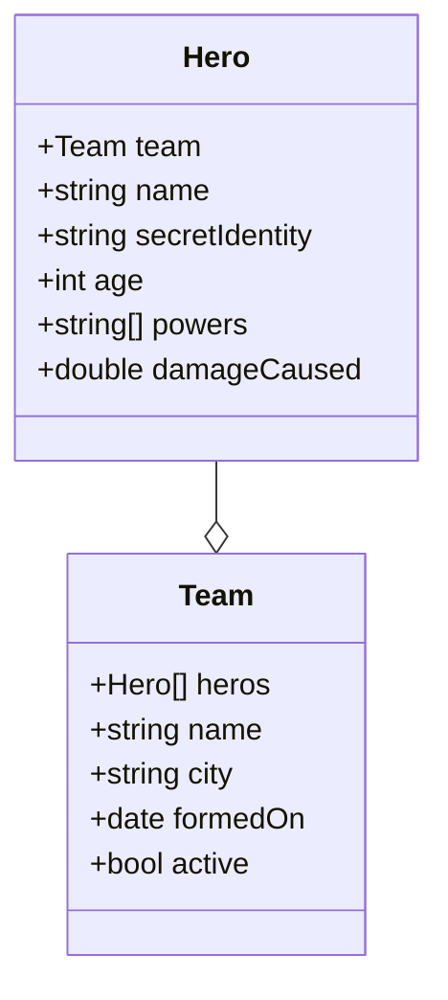

# Project Documentation

Here are our proposed data types:

```mermaid
classDiagram
    class Team {
      +Hero[] heros
      +string name
      +string city
      +date formedOn
      +bool active
    }

    class Hero {
      +Team team
      +string name
      +string secretIdentity
      +int age
      +string[] powers
      +double damageCaused
    }

    %%Links between entities - don't worry too much about details
    Hero --o Team
```
