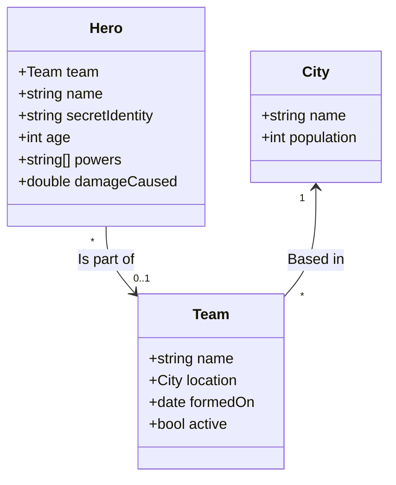

# Project Documentation

Here are our proposed data types:

Relations:

* A **Team** can have any number of **Hero**s (including 0). Each Hero is on at most one team. There is no ownership.
  A hero can leave a team and if a team disbands the Heroes all still exist.
  * Relationship stored on Hero side
  * When a Team is deleted, Heros are updated with the **clear** policy

* A **Team** must be based in a **City**. Multiple teams can be in a City. There is no ownership.
  A Team can leave a city and the city is unaffected.
  * Relationship stored on the Team side
  * A City cannot be deleted if there are Teams in it
