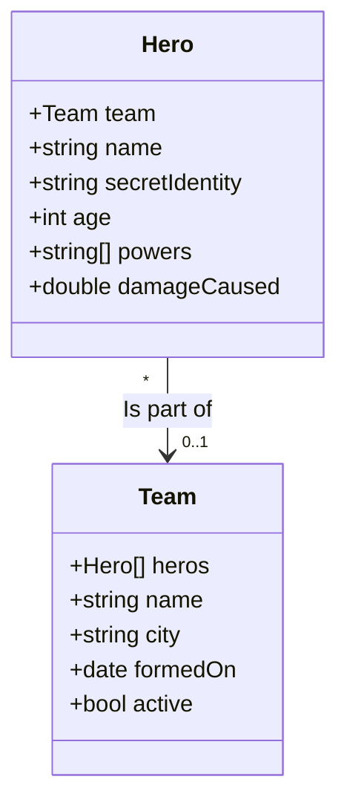

# Project Documentation

Here are our proposed data types:

Relations:

* A **Team** can have any number of **Hero**s (including 0). Each Hero is on at most one team. There is no ownership.
  A hero can leave a team and if a team disbands the Heroes all still exist.
